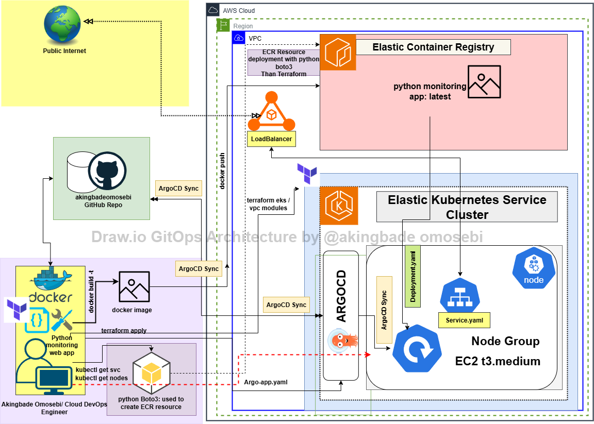

# ☁️ Python Cloud-Native Monitoring App on EKS 🚀

A simple Python Flask web app that monitors system metrics using `psutil` containerized with Docker, pushed to AWS ECR, deployed to EKS with Terraform, and managed via ArgoCD for GitOps-style continuous delivery.

---

## 🗺️ Architecture



## 🗂️ Project Structure

## 🗂️ Project Structure

```plaintext
my-cloud-monitoring-app/
├── Dockerfile
├── requirements.txt
├── app.py                   # Flask app main file
├── templates/               # HTML templates (if any)
├── static/                  # CSS, JS, images (if any)
├── manifests/               # Kubernetes manifests
│   ├── deployment.yaml
│   ├── service.yaml
│   ├── argo-app.yaml
├── terraform/               # Infrastructure as Code (Terraform)
│   ├── main.tf
│   ├── variables.tf
│   ├── outputs.tf
│   ├── provider.tf
│   ├── ...
├── docs/                    # Diagrams, architecture, screenshots
│   ├── architecture.png
│   ├── ...
├── .gitignore
├── README.md


**Main flow:**  
Flask app ➜ Docker ➜ ECR ➜ EKS ➜ Load Balancer ➜ ArgoCD ➜ GitHub Repo ➜ Continuous Deployment

---

## ⚙️ Key Features

- Python Flask app with `psutil` for live system stats
- Dockerized & pushed to private AWS ECR
- Terraform-provisioned VPC & EKS cluster
- Kubernetes manifests (`Deployment` & `Service`) for app rollout
- ArgoCD setup for GitOps auto-sync
- Autoscaling & rolling updates (manual replica tests)
- Real-world troubleshooting: RBAC, instance sizing, cluster networking

---

## 🛠️ Tech Stack

- Python 3.9 + Flask + psutil
- Docker Desktop
- AWS ECR
- AWS EKS
- Terraform
- ArgoCD
- kubectl
- GitHub

---

## 📌 Prerequisites

- AWS account (IAM user with ECR & EKS permissions)
- Terraform installed
- AWS CLI configured (`aws configure`)
- Docker installed & running
- kubectl installed & configured (`aws eks update-kubeconfig`)

---

## 🚢 Build & Push the Docker Image

```bash
# Build the image
docker build -t my-monitoring-app .

# Tag it for ECR
docker tag my-monitoring-app:latest <AWS_ACCOUNT_ID>.dkr.ecr.<REGION>.amazonaws.com/my-cloud-app-repo:latest

# Login to ECR
aws ecr get-login-password --region <REGION> | docker login --username AWS --password-stdin <AWS_ACCOUNT_ID>.dkr.ecr.<REGION>.amazonaws.com

# Push it
docker push <AWS_ACCOUNT_ID>.dkr.ecr.<REGION>.amazonaws.com/my-cloud-app-repo:latest


## 🚢 Build & Push the Docker Image

# Initialize Terraform
terraform init

# Plan infra
terraform plan

# Apply infra
terraform apply


## Deploy the App to EKS
# Apply deployment & service
kubectl apply -f manifests/deployment.yaml
kubectl apply -f manifests/service.yaml


##Install ArgoCD & Connect to GitHub
# Create ArgoCD namespace
kubectl create namespace argocd

# Install ArgoCD
kubectl apply -n argocd -f https://raw.githubusercontent.com/argoproj/argo-cd/stable/manifests/install.yaml

# Patch ArgoCD server to LoadBalancer
kubectl edit svc argocd-server -n argocd
# --> Change type: ClusterIP --> LoadBalancer

# Get ArgoCD admin password
kubectl -n argocd get secret argocd-initial-admin-secret -o jsonpath="{.data.password}" | base64 -d && echo

# Access ArgoCD UI: http://<ARGOCD_ELB_URL>

# Apply your ArgoCD App manifest
kubectl apply -f manifests/argo-app.yaml


✅ Access & Test
Flask App URL: http://<YOUR_LOAD_BALANCER_URL>

ArgoCD UI: http://<ARGOCD_ELB_URL>
Login: admin + password above

Scale replicas, commit manifest changes — ArgoCD will auto-sync!


⚠️ Known Issues
- Using t3.small nodes caused ArgoCD Dex to fail — switched to t3.medium

- IAM RBAC: Ensure your aws-auth ConfigMap allows your IAM user to kubectl get nodes

- Public access & LoadBalancer costs apply


👨🏽‍💻 Author
Akingbade Omosebi — Cloud-Native DevOps & Security | Infrastructure as Code | Container Orchestration
LinkedIn | Dev.to